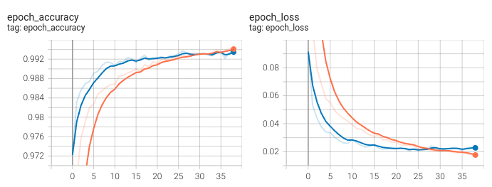

# Typical training

Let's see how a typical training looks like. I will be using Keras for this example. I have prepared
a [Collab notebook](https://colab.research.google.com/drive/1WaNldeUDzEI6MgpqIg_fLxH5IAMd8iJc?usp=sharing)
with all the code. The whole notebook runs in a few minutes.

We just need numpy and keras for this experiment.

```python
import numpy as np
from tensorflow import keras
from tensorflow.keras import layers
```

The MNIST dataset is loaded and preprocessed.

```python
def load_data():
    # Model / data parameters
    num_classes = 10
    input_shape = (28, 28, 1)

    # the data, split between train and test sets
    (x_train, y_train), (x_test, y_test) = keras.datasets.mnist.load_data()

    # Scale images to the [0, 1] range
    x_train = x_train.astype("float32") / 255
    x_test = x_test.astype("float32") / 255
    # Make sure images have shape (28, 28, 1)
    x_train = np.expand_dims(x_train, -1)
    x_test = np.expand_dims(x_test, -1)
    print("x_train shape:", x_train.shape)
    print(x_train.shape[0], "train samples")
    print(x_test.shape[0], "test samples")

    # convert class vectors to binary class matrices
    y_train = keras.utils.to_categorical(y_train, num_classes)
    y_test = keras.utils.to_categorical(y_test, num_classes)

    return x_train, y_train, (x_test, y_test)
```

We define a very simple convolutional neural network architecture.

```python
def get_sample_model(input_shape=(28, 28, 1), num_classes=10):
    model = keras.Sequential(
        [
            keras.Input(shape=input_shape),
            layers.Conv2D(32, kernel_size=(3, 3), activation="relu"),
            layers.MaxPooling2D(pool_size=(2, 2)),
            layers.Conv2D(64, kernel_size=(3, 3), activation="relu"),
            layers.MaxPooling2D(pool_size=(2, 2)),
            layers.Flatten(),
            layers.Dropout(0.5),
            layers.Dense(num_classes, activation="softmax"),
        ]
    )
    return model
```

Finally we have the train function.

```python
def train_model_on_mnist(model, fit_kwargs=None, callbacks=None, compile_kwargs=None):
    default_compile_kwargs = dict(loss="categorical_crossentropy", optimizer="adam", metrics=["accuracy"])
    if compile_kwargs is not None:
        default_compile_kwargs.update(compile_kwargs)
    model.compile(**default_compile_kwargs)

    default_callbacks = [
        keras.callbacks.ReduceLROnPlateau(monitor='loss', patience=10000),
    ]
    if callbacks is not None:
        default_callbacks += callbacks

    default_fit_kwargs = dict(verbose=0, epochs=1000, validation_data=test_data)
    if fit_kwargs is not None:
        default_fit_kwargs.update(fit_kwargs)
    ret = model.fit(x_train, y_train,
                    callbacks=default_callbacks, **default_fit_kwargs)
    return ret.history
```

And we call the train function to fit the model.

```python
x_train, y_train, test_data = load_data()
train_model_on_mnist(
    get_sample_model(),
    fit_kwargs=dict(batch_size=128, verbose=1, epochs=100),
    compile_kwargs=dict(optimizer=keras.optimizers.Adam(1e-3)),
    callbacks=[
        keras.callbacks.TensorBoard(log_dir='logs'),
        keras.callbacks.EarlyStopping(patience=15),]
);
```

We can use Tensorboard to visualize the train (orange) and validation (blue) metrics during the training.



Validation accuracy reaches 99.4% accuracy which is consistent with the state of the art.

We have trained a neural network on the MNIST dataset, now let's think deeply about all the steps
and its implications.
